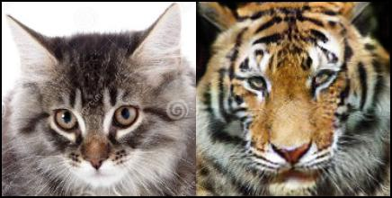
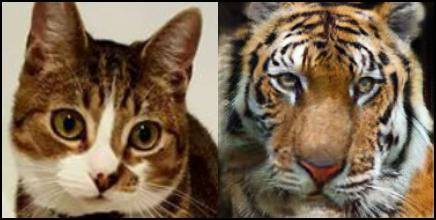
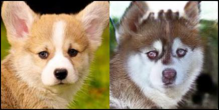
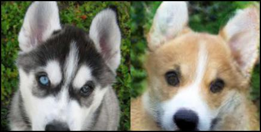

## PyTorch Implementation of the Coupled GAN algorithm for Unsupervised Image-to-Image Translation

### License

Copyright (C) 2017 NVIDIA Corporation.  All rights reserved.
Licensed under the CC BY-NC-ND 4.0 license (https://creativecommons.org/licenses/by-nc-nd/4.0/legalcode). 

### Paper

[Ming-Yu Liu, Thomas Breuel, Jan Kautz, "Unsupervised Image-to-Image Translation Networks" NIPS 2017](https://arxiv.org/abs/1703.00848)

Please cite our paper if this software is used in your publications.

### Dependency
pytorch, yaml, opencv, and tensorboard (from https://github.com/dmlc/tensorboard).

If you use Anaconda2, then the following commands can be used to install all the dependencies.

```
conda install pytorch torchvision cuda80 -c soumith
conda install -c anaconda yaml=0.1.6
conda install -c menpo opencv=2.4.11
pip install tensorboard
```

### Example Usage

#### Testing 

###### Cat to Tiger Translation
1. Download the pretrained model in [link](https://drive.google.com/open?id=0BwpOatrZwxK6V1Bwai1GZFQ2Q0k) to <outputs/unit/cat2tiger>

2. Go to <src> and run to translate the first cat and second cat to tigers
    ```
    python cocogan_translate_one_image.py --config ../exps/unit/cat2tiger.yaml --a2b 1 --weights ../outputs/unit/cat2tiger/cat2tiger_gen_00500000.pkl --image_name ../images/cat001.jpg --output_image_name ../results/cat2tiger_cat001.jpg
    ```
    ```
    python cocogan_translate_one_image.py --config ../exps/unit/cat2tiger.yaml --a2b 1 --weights ../outputs/unit/cat2tiger/cat2tiger_gen_00500000.pkl --image_name ../images/cat002.jpg --output_image_name ../results/cat2tiger_cat002.jpg
    ```

4. Check out the results in <results>. Left: Input. Right: Output
 - 
 - 
 
###### Corgi to Husky Translation
1. Download the pretrained model in [link](https://drive.google.com/open?id=0BwpOatrZwxK6NktUSWZRNE14Ym8) to <outputs/unit/corgi2husky>

2. Go to <src> and run to translate the first cat and second cat to tigers
    ```
    python cocogan_translate_one_image.py --config ../exps/unit/corgi2husky.yaml --a2b 1 --weights ../outputs/unit/corgi2husky/corgi2husky_gen_00500000.pkl --image_name ../images/corgi001.jpg --output_image_name ../results/corgi2husky_corgi001.jpg
    ```
    ```
    python cocogan_translate_one_image.py --config ../exps/unit/corgi2husky.yaml --a2b 0 --weights ../outputs/unit/corgi2husky/corgi2husky_gen_00500000.pkl --image_name ../images/husky001.jpg --output_image_name ../results/husky2corgi_husky001.jpg
    ```

4. Check out the results in <results>. Left: Input. Right: Output
 - 
 - 
 
#### Training
1. Download the aligned and crop version of the [CelebA dataset](http://mmlab.ie.cuhk.edu.hk/projects/CelebA.html) to <datasets/celeba>. 

2. Go to <datasets/celeba> and crop the middle region of the face images and resize them to 128x128
    ```
    python crop_and_resize.py;
    ```

3. Setup the yaml file. Check out <exps/unit/blondhair.yaml>

4. Go to <src> and do training
     ```
    python cocogan_train.py --config ../exps/unit/blondhair.yaml --log ../logs
    ```
5. Go to <src> and do resume training 
     ```
    python cocogan_train.py --config ../exps/unit/blondhair.yaml --log ../logs --resume 1
    ```
    
6. Intermediate image outputs and model binary files are in <outputs/unit/blondhair>

#### SVHN2MNIST Adaptation

1. Go to <src> and execute
     ```
    python cocogan_train_domain_adaptation.py --config ../exps/unit/svhn2mnist.yaml --log ../logs
    ```